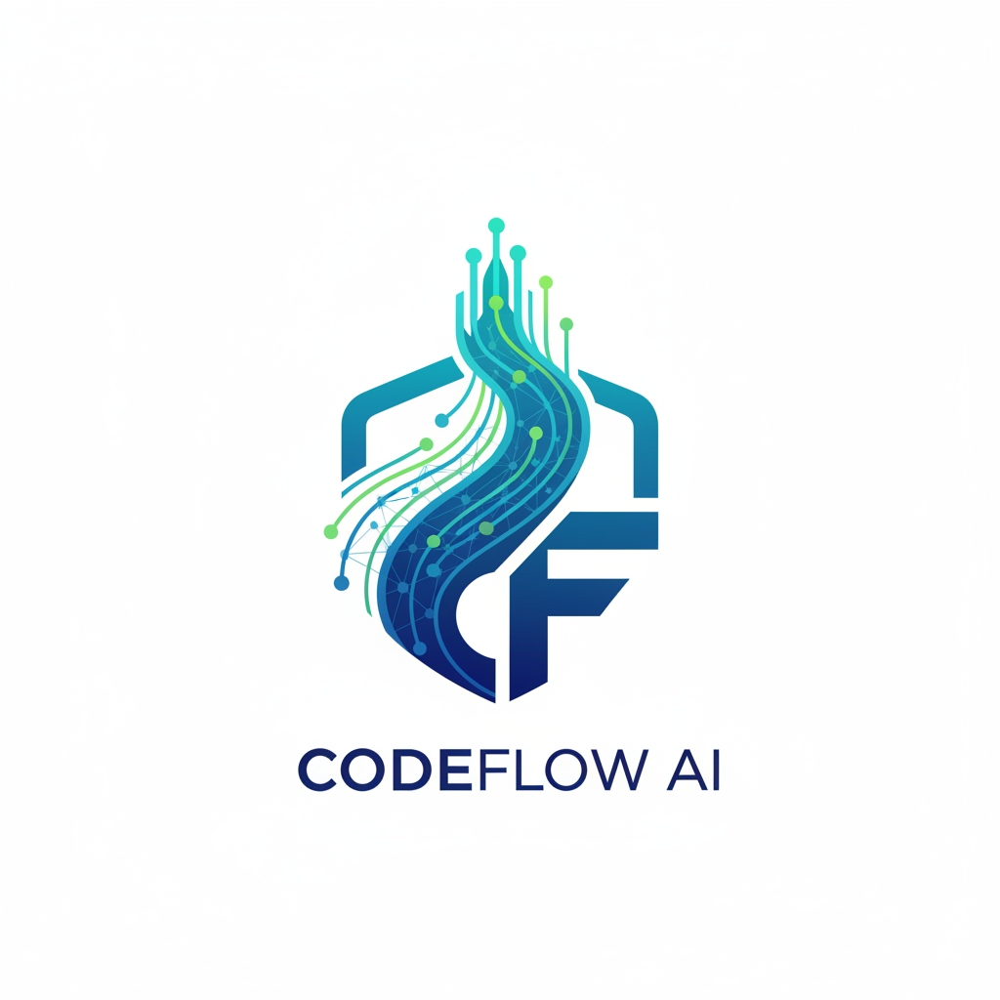
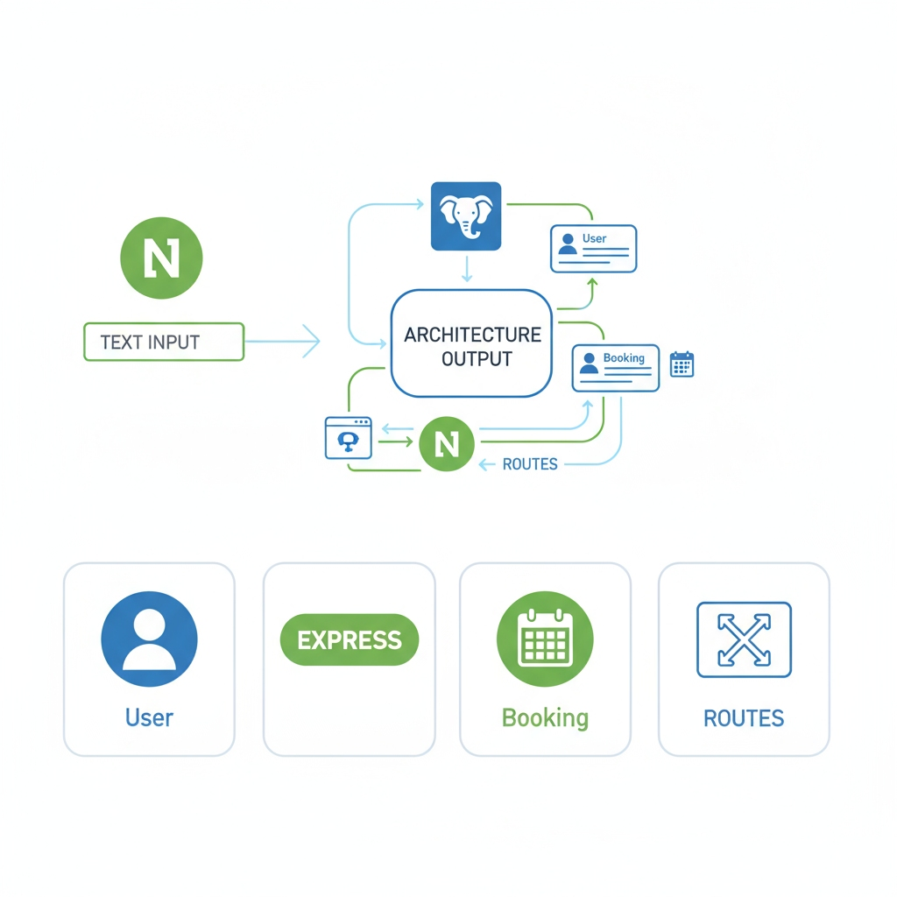
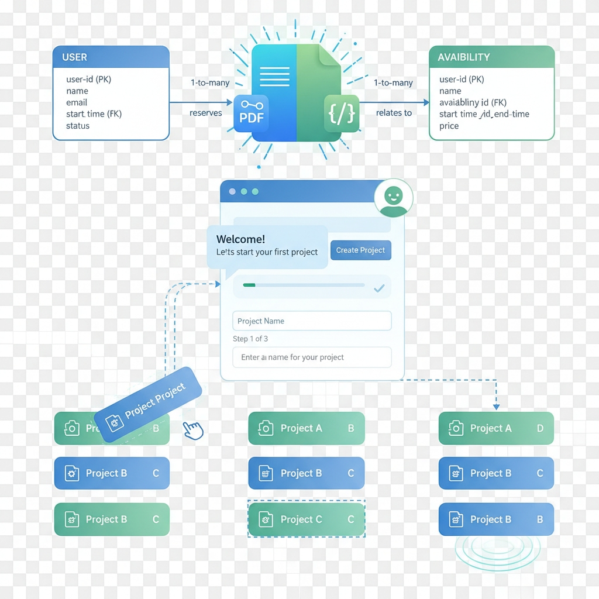

```
   _____ ____  _____  ______ ______ _      ______          __           _____ 
  / ____/ __ \|  __ \|  ____|  ____| |    / __ \ \        / /     /\   |_   _|
 | |   | |  | | |  | | |__  | |__  | |   | |  | \ \  /\  / /     /  \    | |  
 | |   | |  | | |  | |  __| |  __| | |   | |  | |\ \/  \/ /     / /\ \   | |  
 | |___| |__| | |__| | |____| |    | |___| |__| | \  /\  /     / ____ \ _| |_ 
  \_____\____/|_____/|______|_|    |______\____/   \/  \/     /_/    \_\_____|
                                                                              
```  
                                                                     

# 🚀 CodeFlow AI — Version Bêta


<p align="left">
  
  
  
  
</p>

CodeFlow AI est un projet en **version bêta avancée**, conçu pour devenir l’un des générateurs de projets les plus complets et intuitifs du marché.  
Son but : transformer une simple phrase en une architecture backend ou full‑stack complète, propre, maintenable et prête à être lancée.

Cette bêta représente la base d’une vision beaucoup plus grande : permettre à n’importe quel développeur, étudiant ou entreprise, de générer un projet entier en quelques secondes.

---

## 🎯 Vision du projet

CodeFlow AI a été imaginé comme un **assistant développeur IA**, capable de comprendre une demande formulée en langage naturel et de créer automatiquement :

- une structure de projet cohérente,  
- des fichiers organisés comme dans un vrai environnement pro,  
- du code propre et commenté,  
- des routes, services, modèles et contrôleurs,  
- et bientôt… un **ZIP complet** ou un **projet frontend + backend entièrement généré**.

L’objectif final est simple mais ambitieux :  
> **Créer une application complète à partir d’une seule phrase.**

---

## 🧠 Fonctionnement actuel (Bêta)

Aujourd’hui, CodeFlow AI sait :

### 🔹 1. Générer des backends complets  
À partir d’un prompt comme :  
> *“Génère une API Node.js avec authentification JWT, CRUD tâches et base PostgreSQL.”*

L’IA répond en produisant :
- une description précise du backend,
- les entités nécessaires,
- les routes complètes,
- les fichiers à créer,
- des exemples de code pour chaque fichier.

### 🔹 2. Afficher les fichiers générés dans l’interface  
Grâce au frontend React, on peut :
- parcourir les fichiers générés,
- voir le contenu de chaque fichier dans un éditeur intégré,
- copier un fichier en un clic,
- conserver l’historique des prompts,
- regénérer ou comparer plusieurs résultats.




### 🔹 3. Générer dans le backend un dossier structuré  
Le backend peut écrire les fichiers générés dans  
`backend/generated/<nom-du-projet>/…`  
pour faciliter l’export ou le packaging futur.

---

## 🚧 Fonctionnalités futures (Roadmap)

Cette bêta n’est qu’une fondation. La suite va amener des fonctionnalités beaucoup plus puissantes :

### 🔥 Prochaines étapes (développement actif)
- Génération **d’un frontend complet** (React, Next.js, Tailwind)
- Génération **d’un ZIP téléchargeable** contenant tout le projet
- Structure full-stack complète : `backend + frontend + documentation`
- Système de presets (templates prédéfinis : SaaS, API, e-commerce…)
- Génération de Dockerfile + docker-compose automatiques
- Validation de schémas avec Zod / Joi
- Export direct vers un dépôt GitHub

### 🚀 Version stable (objectif long terme)
- Interface avancée façon IDE  
- Personnalisation visuelle du projet généré  
- Connexion à une base cloud pour héberger les projets générés  
- Collaboration en temps réel (générer à plusieurs)  
- Assistant IA intégré pour continuer le développement du projet généré  
- Marketplace de templates créés par la communauté  

---

## 🧩 Structure du projet

Le dépôt se présente comme un **monorepo simple** :

```
CODEFLOW-AI/
│
├── backend/        → API Express + moteur Groq + génération
│   ├── src/
│   └── generated/   → fichiers générés par l’IA
│
├── frontend/       → Interface React (Vite)
│   ├── src/
│   └── public/images/   → logos + illustrations
│
└── codegen/        → templates + prompts (bientôt utilisés)
```

---

## 🛠️ Installation et lancement

### 1. Lancer le backend
```
cd backend
npm install
npm start
```

Le backend démarre sur :  
👉 http://localhost:4000

### 2. Lancer le frontend
```
cd frontend
npm install
npm run dev
```

Le frontend démarre sur :  
👉 http://localhost:5173

---

## 🧪 Exemple de prompt

> **“Crée un backend Node.js avec Express, authentification JWT, gestion utilisateurs, CRUD tasks, PostgreSQL et Dockerfile.”**

Résultat :
- architecture complète proposée  
- fichiers listés  
- code généré  
- aperçu utilisable directement  
- possibilité de copier-coller chaque fichier

---

## 💬 Statut actuel

CodeFlow AI est en **version bêta** :  
- stable pour la génération de backends simples,
- en cours de transition vers un générateur full-stack complet,
- avec une interface encore minimaliste mais déjà agréable et évolutive.

Chaque mise à jour rapproche CodeFlow AI de son but :
> **devenir la plateforme la plus rapide pour générer une application complète.**

---

## ❤️ Contributeurs & objectifs

Ce projet a pour ambition de devenir un véritable outil SaaS.  
Toute contribution, idée ou amélioration est la bienvenue — le but est de créer un outil réellement utile aux développeurs de tous niveaux.

---

## 🌟 Conclusion

CodeFlow AI n’en est qu’à ses débuts, mais les fondations sont déjà solides.  
La vision est claire : créer la plateforme ultime permettant de générer un backend, un frontend, la documentation, les configurations… et un projet complet prêt à déployer.

Ce n’est que le début. La suite arrive très vite.
